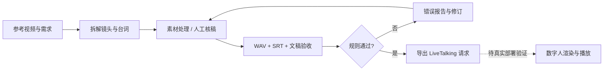

# 数字人口播工作流 · 素材验收与 LiveTalking 接口适配

把参考视频分析、口播素材准备和交付前验收串成可复现的工作流。面向数字人售前 PoC、内容生产和交付验收。

**当前可复现成果：14 项自动化测试；一个通过样例和一个字幕越界失败样例；LiveTalking `/human` 请求导出。** 这些是本地素材检查与接口参数适配，不是已完成数字人渲染。本次未运行 Seedance 生成、ASR、TTS、GPU 推理或真实 LiveTalking 服务。

## 先看结果

| 输入 | 结果 | 含义 |
|---|---|---|
| 3 秒合成音频 + 2.9 秒字幕 + 一致的文稿 | PASS | 本地文件与时间规则通过 |
| 同一音频 + 4 秒字幕 | FAIL：subtitle_exceeds_audio | 阻止超出音频时长的字幕交付 |
| 文稿“199元”与字幕“99元” | FAIL：script_subtitle_mismatch | 保留数字和标点检查，不掩盖金额变化 |

测试使用合成正弦音，不是真人口播；PASS 不代表语音与文字语义一致，也不代表口型准确。

## 一分钟复现

仅需 Python 3.9+，新增验收模块无第三方依赖、无需账号或 GPU：

```bash
python3 avatar_qa.py demo --out runs/avatar-demo
python3 -m unittest discover -s . -p 'test_avatar_qa.py' -v
```

输出包括 `pass-report.json`、`fail-report.json`、`human-request.json`，以及合成音频、SRT、文稿。报告记录文件 SHA-256、音频指标、阈值和未测能力。

检查自己的素材（WAV 需预先转成 16kHz / mono / PCM16）：

```bash
python3 avatar_qa.py check --audio voice.wav --srt captions.srt --script script.txt --out runs/qa.json
```

退出码：0=规则通过，1=验收失败，2=输入或格式错误。静音阈值 -50 dBFS、削波比例阈值 0.1% 是本项目的可解释初始规则，不是行业标准。音频最大 600 秒。

## 与热门开源项目的关系

选用 [LiveTalking](https://github.com/lipku/LiveTalking) 作为下游集成方向。对照其 [server/routes.py](https://github.com/lipku/LiveTalking/blob/main/server/routes.py) 的 `/human` 接口，导出 `sessionid/type/text/interrupt` 请求体；使用 `echo` 保留已审核台词，默认不打断当前会话。接口依据检索于 2026-09-07，跟随上游 main，后续部署应锁定提交并再次做契约测试。

```bash
python3 avatar_qa.py request --script script.txt --session-id YOUR_EXISTING_SESSION --out runs/human-request.json
```

此命令只生成 JSON。真实运行需要先在 LiveTalking 建立会话，再由调用方把 JSON POST 到自己部署的 `/human`。HTTP 接受不等于已播放完成；还需测浏览器首帧、首音、音画同步和打断表现。本仓库不包含 LiveTalking 引擎、模型权重或声称对其上游有贡献。

## 项目结构与贡献

- `avatar_qa.py`：本次新增，WAV 校验、严格 SRT 解析、文稿一致性检查、合成演示、LiveTalking 请求导出。
- `test_avatar_qa.py`：本次新增，14 个可复现的正常与异常行为测试。
- `REVIEW.md`：选型、改进复盘、验证边界和面试讲解。
- `TEST_RESULTS.txt`：本次本地执行日志，非线上 CI 声明。
- `SKILL.md`、`references/`、`agents/`：原有的视频分析与生成操作流程。
- `scripts/prepare_video_assets.py`、`scripts/cut_reference_clips.py`：原有 FFmpeg 素材处理脚本，需要 FFmpeg；本次未重跑完整视频生成链路。



代码与文档使用 AI 辅助开发；个人贡献应以自己能够解释、修改和复现的部分为准。没有真实客户素材、业绩数字、模型训练成果或未经验证的性能承诺。
